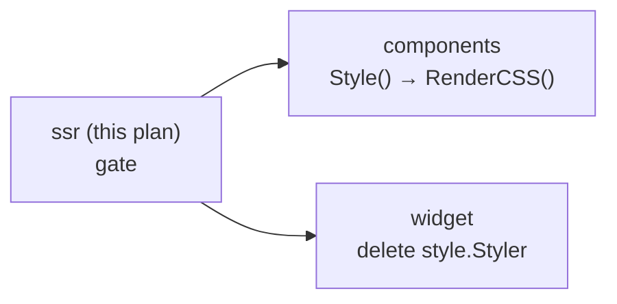

> This plan is dispatched via the CodeJob workflow. See skill: **agents-workflow**.

# Plan — `tinywasm/ssr`: one CSS provider contract, not three

This repo is the **gate** of a three-repo change. Nothing else can move until this ships.

---

## 1. The problem, measured

`ssr` discovers a package's SSR assets by scanning `css.go`/`js.go`/`svg.go`/`html.go` for
method names. Today it recognises **three** different ways to provide CSS:

| Method | Emitted into | Declared by |
|---|---|---|
| `RootCSS() *css.Stylesheet` | `CollectorOutput.Root` | `github.com/tinywasm/css` (free function) |
| `RenderCSS() *css.Stylesheet` | `CollectorOutput.Render` | `tinywasm/layout` (3 packages), app modules |
| `Style() *style.Sheet` | `CollectorOutput.Render` | `tinywasm/components` (8 packages, **unpublished**) |

`RootCSS` and `RenderCSS` are orthogonal — document-level tokens vs. component sheet — and map
1:1 onto the two output fields. `Style()` is a **third path to the same output field as
`RenderCSS`**, and when a package declares both, `invoke.go` concatenates them
(`s.Render += …` twice). That is the duplication this plan removes.

### Why `Style()` is the one that goes

`invoke.go` states its own invariant, immediately above the regex table:

> *"Feature detection matches on the METHOD NAME only — never on its return type or the package
> that type comes from. That is what let `IconSvg()` switch from `*svg.Sprite` to
> `*sprite.Sprite` without touching a single pattern here, and it is why the generated
> `main.go` can keep `Icons any`."*

The `Style()` branch breaks exactly that. It hardcodes
`widgetStylePkg = "github.com/tinywasm/widget/style"`, emits `import twstyle "…/widget/style"`
into the generated `main.go`, and asserts `var w twstyle.Styler = inst`. A generic asset
extractor became coupled to one specific styling library — a violation of *lego pieces, never
forks* in
[CONSTRUCTION_HARNESS.md](https://github.com/tinywasm/app-releases/blob/main/docs/CONSTRUCTION_HARNESS.md).

**No published module depends on `Style()`.** `tinywasm/components` last published `v0.1.9`,
which predates its `Style()` migration. Deleting this branch breaks nothing that is released.

---

## 2. Scope — read before touching anything

Two changes, one commit:

1. **Delete** the `Style()` detection branch and every symbol that exists only to serve it.
2. **Add** a loud development diagnostic that closes the silent-failure hole the `Style()`
   branch was trying to close — without coupling `ssr` to anything.

**FORBIDDEN — do not do any of this:**

| Prohibition | Reason |
|---|---|
| Replacing the regex scanner with typed interfaces / a registry | **Rejected, not postponed.** `ssr` compiles a *separate* `main.go` because the providers are `//go:build !wasm` while the app is WASM, so a capability registry needs a registration site in every application — a *"remember to register"* step, which the harness counts as a hole, not a closure. And the assertion it would use (`if s, ok := p.(Styler); ok`) skips a misnamed method **silently** — the very defect it claims to fix. Stage 2 closes that defect instead, at principle 6's second tier: *compile error → **loud development diagnostic** → (never) silent failure*. Nothing is left open here. |
| Adding `github.com/tinywasm/widget` or `.../widget/style` to `go.mod` | The whole point is that `ssr` stops knowing this package exists. |
| Keeping `Style()` working "for compatibility" | There is no published consumer. A transitional path is the duplication this plan deletes. |
| Renaming `RootCSS` or `RenderCSS` | They stay exactly as they are. |
| Broadening the new diagnostic to `js.go`/`svg.go`/`html.go` | Only `css.go` is in scope. A package may legitimately carry `html.go` with no provider — `tests/no_provider_skipped_test.go` asserts that and must keep passing. |
| Using `go test` | This repo uses `gotest`. |

---

## 3. Stage 1 — delete the `Style()` branch

File: `invoke.go`. Every item below is a deletion.

### 3.1 Constant

Remove `widgetStylePkg` from the `const` block (~line 36). `aliasPrefix` stays.

```go
const (
	aliasPrefix = "m_"
)
```

### 3.2 `moduleAlias`

Remove the `HasStyle` field (~line 45) and its term in `HasAnyFeature` (~line 52):

```go
func (m moduleAlias) HasAnyFeature() bool {
	return m.HasRoot || m.HasRender || m.HasHTML || m.HasJS || m.HasIcons
}
```

### 3.3 The generated-`main.go` template (`GenerateExtractorMain`)

- Remove the import line `{{if .AnyStyle}}twstyle "{{.WidgetStylePkg}}"{{end}}` (~line 96).
- Remove this whole block from the `{{if .ReceiverType}}` branch (~lines 126-131):

  ```
  {{if .HasStyle}}
  {
  	var w twstyle.Styler = inst
  	s.Render += w.Style().Stylesheet().String()
  }
  {{end}}
  ```

- Remove the `anyStyle` loop (~lines 166-172) and the `AnyStyle` / `WidgetStylePkg` fields from
  the anonymous `data` struct and its literal (~lines 174-181). What remains:

  ```go
  data := struct {
  	Modules []moduleAlias
  }{
  	Modules: aliases,
  }
  ```

### 3.4 Regex and receiver detection

- Remove `reStyle` from the `var (…)` block (~line 200).
- Remove `reStyle` from the `regs` slice in `detectReceiverType` (~line 351):

  ```go
  regs := []*regexp.Regexp{reRootCSS, reRenderCSS, reRenderHTML, reRenderJS, reIconSvg}
  ```

### 3.5 `importsWidgetStyle` and its call site

- Delete the entire `importsWidgetStyle` function (~lines 278-292) **and** its doc comment.
- In `modulesToAliases`, delete `ma.HasStyle = reStyle.Match(combinedContent)` (~line 325) and
  the whole guard (~lines 337-342):

  ```go
  if !ma.HasStyle && importsWidgetStyle(m.dir) {
  	return nil, fmt.Err("ssr: package", m.path, …)
  }
  ```

  It is replaced in stage 2 — do not simply move it.

### 3.6 Imports left dangling

`go/parser` and `go/token` are used in `invoke.go` **only** by `importsWidgetStyle`. Remove both
from `invoke.go`'s import block. **Do not touch `scanner.go`**, which imports them for its own
use (`scanner.go:99-100`) and is unrelated to this plan.

---

## 4. Stage 2 — the loud diagnostic that replaces it

The deleted guard existed for a real reason: a CSS builder whose method is misnamed is
**silently never emitted** — the component renders unstyled and nothing fails at build time.
That hole is closed here without naming any styling library.

In `modulesToAliases`, at the same place the deleted guard occupied (after feature detection,
before `aliases = append(...)`), add:

```go
// A css.go that declares no provider is always a defect: the file exists to be
// collected, and a misnamed builder is otherwise emitted nowhere and fails silently
// — the component renders unstyled and the build stays green.
if hasCSSSource(m.dir) && !ma.HasRoot && !ma.HasRender {
	return nil, fmt.Err("ssr: package", m.path,
		"has "+cssSourceFile+" but declares no RootCSS() or RenderCSS();",
		"expected: func (w *T) RenderCSS() *css.Stylesheet")
}
```

Supporting declarations, in `extract.go` next to `ssrSourceFiles` (line 16):

```go
const cssSourceFile = "css.go"

var ssrSourceFiles = []string{cssSourceFile, "js.go", "svg.go", "html.go"}
```

And in `invoke.go`, next to `hasSSRSource`:

```go
// hasCSSSource reports whether dir carries a css.go at all.
func hasCSSSource(dir string) bool {
	_, err := os.Stat(filepath.Join(dir, cssSourceFile))
	return err == nil
}
```

**Precision notes for the executor:**

- The guard runs only when `m.dir != ""` — keep it inside the existing `if m.dir != ""` block,
  same as the guard it replaces. A module with no local directory is skipped.
- The check is on **`css.go` specifically**, never on the other three SSR files.
- `RootCSS` alone is enough to satisfy it (`config/css.go` in a real app often declares only
  that).
- Detection already merges all four SSR files into one blob before matching, so a `RenderCSS`
  declared in, say, `html.go` still satisfies the guard. That is intended; do not narrow the
  match to `css.go`'s own content.

---

## 5. Stage 3 — tests

### 5.1 Delete

| File | Why |
|---|---|
| `tests/style_extraction_test.go` | Asserts CSS is collected from a `Style()` method. The path no longer exists. |
| `tests/style_misnamed_test.go` | Asserts the exact error string `imports github.com/tinywasm/widget/style but declares no Style() method`. Replaced by 5.2. |

### 5.2 Rewrite

`tests/real_finder_test.go` builds a fixture whose widget implements `Style()` (lines ~36, ~54,
~78). It is the **only** test in this repo that uses the real finder (no `Seed`), runs
`go mod tidy`, and compiles the fixture against the real `tinywasm/widget` and `tinywasm/css`.
That makes it this library's consumer-shaped proof, in the sense CONSTRUCTION_HARNESS means it:

> *"A library tested only in isolation — with opaque doubles standing in for its real
> collaborators — hides its gaps until a consumer hits them."*

**So it keeps the real stack.** Do **not** replace `style.Of(...)` with a local
string-type-with-`String()` double the way `tests/extract_subpackage_test.go:42` does — that
fixture is a deliberate isolation test and this one is deliberately not. Downgrading it here
would delete the only end-to-end evidence that a real `style`-built sheet still reaches
`assets.CSS`.

Change exactly three things inside the fixture, and nothing else:

1. The method:

   ```go
   func (m *MyWidget) RenderCSS() *css.Stylesheet {
   	return style.Of(m.WidgetName()).Root(style.Pad(style.Space0)).Stylesheet()
   }
   ```

2. Its import block gains `"github.com/tinywasm/css"`. `widget` and `widget/style` **stay** —
   the fixture still builds its sheet with the DSL, which is the point.

3. The fixture's inline `go.mod` string bumps its stale pins to the published versions:
   `github.com/tinywasm/widget v0.1.0` → `v0.3.0`, `github.com/tinywasm/css v0.2.0` → `v0.3.0`.
   `go mod tidy` runs inside the fixture and will resolve the rest.

Then update the two `Style()` mentions in the surrounding Go source, which acceptance criterion
§6.2 greps for:

- the comment at line ~36, `// Create a subpackage with a widget implementing Style()` →
  `// Create a subpackage with a widget implementing RenderCSS()`;
- the failure message at line ~78, `expected CSS from the widget's Style()` →
  `expected CSS from the widget's RenderCSS()`.

The assertion itself (`strings.Contains(assets.CSS, "my-widget")`) does not change: the emitted
selector is still derived from `WidgetName()`.

**No circular gate.** This fixture needs a `widget` that has `style.Of(...)` — every published
version does. It does **not** need the `widget` release that deletes `Styler`, so this repo can
ship first.

### 5.3 Add

New file `tests/css_no_provider_test.go`, mirroring the structure of the deleted
`style_misnamed_test.go`: a fixture package with a `css.go` that declares a **misnamed**
builder (`GenerateCSS`) and no `RootCSS`/`RenderCSS`, asserting `ExtractModule` returns an error
containing verbatim:

```
has css.go but declares no RootCSS() or RenderCSS()
```

The fixture must **not** import `github.com/tinywasm/widget/style`, and needs no dependency at
all: a plain `func (m *MyWidget) GenerateCSS() string` is enough.

**This is not a ban on the import** — §5.2's fixture keeps it deliberately. The point here is
that the new guard fires on one condition only: *a `css.go` exists and declares no provider*.
A fixture that pulled in `widget/style` would leave it ambiguous whether the error came from
that import (the old, deleted rule) or from the new rule. Keeping it dependency-free is what
proves the guard no longer knows any styling library exists.

### 5.4 Must keep passing untouched

`tests/no_provider_skipped_test.go` — its fixture uses `config/html.go` with no providers, and
the new guard only inspects `css.go`. If this test fails, the guard was written too broadly:
fix the guard, not the test.

---

## 6. Acceptance criteria — grep-verifiable

1. `gotest` green.
2. `grep -rn "Style()\|Styler\|widgetStylePkg\|HasStyle\|AnyStyle\|importsWidgetStyle" --include='*.go' .` → **empty**.
3. `grep -rn "tinywasm/widget" go.mod go.sum` → **empty** (it was never there; confirm it was not added).
4. `grep -n "go/parser\|go/token" invoke.go` → **empty**.
5. `grep -rn "twstyle" .` → **empty**.
6. `ls tests/style_extraction_test.go tests/style_misnamed_test.go` → **both absent**.
7. `ls tests/css_no_provider_test.go` → **present**.
8. `grep -rn "reStyle" .` → **empty**.
9. The generated extractor still emits `RootCSS`/`RenderCSS`/`RenderHTML`/`RenderJS`/`IconSvg`
   exactly as before: `tests/deterministic_order_test.go`, `tests/extract_module_root_test.go`
   and `tests/extract_dependency_module_test.go` pass **without modification**. If any of them
   needs editing, the change went beyond scope.

---

## 7. Go quality checklist (mandatory)

- Errors via `github.com/tinywasm/fmt` (`fmt.Err(...)`), never stdlib `errors`/`fmt`.
  **Anti-footgun:** `ssr` is backend tooling, not WASM-shared code — its use of `os`,
  `os/exec`, `path/filepath`, `go/parser`, `text/template` and `encoding/json` is legitimate.
  Do **not** "fix" those stdlib imports.
- No repeated string literals: `"css.go"` becomes the `cssSourceFile` constant and both
  `ssrSourceFiles` and `hasCSSSource` use it.
- No `any`, no `map` in new API.
  **Not a violation:** the generated `main.go` declares `Icons any`. That is the JSON encode
  boundary — the harness allows `any` *"only at the I/O edge, never in the data"* — and it is
  what lets the extractor compile standalone against whatever the target module's `IconSvg()`
  returns. `ssr`'s own `CollectorOutput.Icons` stays typed as `*sprite.Sprite`. Leave both
  exactly as they are.
- Every deletion in §3 is a deletion. Do not comment code out, do not leave a
  `// removed: …` marker.

---

## 8. Stages table

| # | Stage | Files | Gate |
|---|---|---|---|
| 1 | Delete the `Style()` branch | `invoke.go` | `go build ./...` |
| 2 | Loud diagnostic for a providerless `css.go` | `invoke.go`, `extract.go` | `go build ./...` |
| 3 | Tests: delete 2, rewrite 1, add 1 | `tests/` | `gotest` green |

Sequential. Stage 3 is the real gate.

---

## 9. Downstream — informational, not this agent's work

Once this ships and is published, two repos follow (each has its own plan):



- [`tinywasm/components`](https://github.com/tinywasm/components/blob/main/docs/PLAN.md) renames
  its eight `Style()` methods to `RenderCSS()`.
- [`tinywasm/widget`](https://github.com/tinywasm/widget/blob/main/docs/PLAN.md) deletes the
  `style.Styler` interface, whose only consumer was the code deleted here.

Both are blocked on this. Do not attempt either from this repo.
