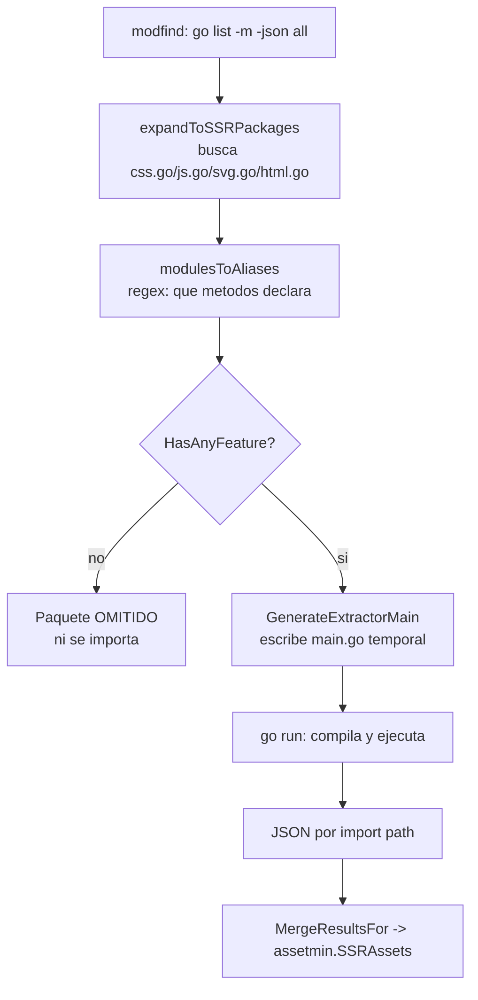

> Este plan se despacha con el flujo CodeJob. Ver skill: **agents-workflow**.

# Plan — `tinywasm/ssr`: adoptar `style.Styler` sin tocar la arquitectura de extracción

## ⚠️ 0. Alcance — LEE ESTO ANTES DE TOCAR NADA

Este plan es **aditivo y pequeño**. La arquitectura de extracción de `tinywasm/ssr`
**funciona y se conserva completa**. Un intento anterior la reescribió y rompió la
extracción de cualquier app real; este plan existe para hacer el cambio bien.

**PROHIBIDO — no hagas nada de esto:**

| Prohibición | Motivo |
|---|---|
| Borrar el escaneo por regex de `invoke.go` | Es el mecanismo de descubrimiento. Sin él nada se extrae. |
| Borrar `moduleAlias.HasAnyFeature()` o los guards `{{if .HasAnyFeature}}` | Es el **filtro de participación**. Sin él, todo módulo del grafo de dependencias con un archivo llamado `css.go`/`js.go`/`svg.go`/`html.go` entra a la fuerza y el `main.go` generado no compila. `github.com/tinywasm/fmt` tiene un `html.go` y no tiene nada que ver con SSR. |
| Borrar `detectReceiverType()` | Es como se obtiene la instancia sobre la que se asevera la capacidad. |
| Introducir una función exportada obligatoria por paquete (`SSR()`, `SSRInstance()`, o similar) | Ese patrón ya existió como `SSRInstance()` y **se eliminó a propósito** por boilerplate (`assetmin`, commit `c95bc46 feat: remove SSRInstance and auto-detect receiver types`). No se reintroduce. |
| Tocar `RootCSS`, `RenderHTML`, `RenderJS` o `IconSvg` | **No existe API nueva para ellos.** Ver §2. Se quedan exactamente como están. |
| Borrar la detección de `RenderCSS` | `github.com/tinywasm/css` lo expone como **función libre** para el reset base y no es un widget. Si lo borras, el CSS base del framework deja de emitirse. |
| Añadir `golang.org/x/tools` o cualquier dependencia nueva salvo `github.com/tinywasm/widget` | Fuera de alcance. |
| Cambiar `cache.go`, `extract.go`, `ssr.go` | No los toca este plan. |

**Anti-footgun de ecosistema:** la regla *"sin librería estándar"* de TinyWasm aplica a
paquetes que compilan a WASM. **`tinywasm/ssr` es herramienta de backend** y usa
legítimamente `regexp`, `os`, `path/filepath`, `text/template`, `encoding/json`,
`go/parser`, `go/token`. **No "arregles" esos imports.** La única convención de la casa que
sí aplica aquí: los errores se construyen con `github.com/tinywasm/fmt` (`fmt.Err(...)`),
como ya hace el repo.

---

## 1. El problema, con precisión

`invoke.go` detecta qué aporta un paquete buscando por **nombre exacto de método** sobre el
texto fuente: `RootCSS`, `RenderCSS`, `RenderHTML`, `RenderJS`, `IconSvg`.

Para CSS de componentes eso es un fallo silencioso: un builder llamado `GenerateCSS` en vez
de `RenderCSS` **nunca se emite**, el componente se renderiza sin estilos y nada falla en
build.

Ahora existe `github.com/tinywasm/widget/style`, que ya expresa esa capacidad como un
**tipo**:

```go
// github.com/tinywasm/widget/style — sheet.go (ya publicado, v0.1.0)
type Styler interface {
	widget.Widget          // WidgetName() Name · WidgetKind() Kind
	Style() *Sheet
}
```

Que `Styler` **embeba `widget.Widget`** es lo que da la garantía: si el método se llama mal,
o su firma no cuadra, o al tipo le falta `WidgetName()`, entonces **no satisface `Styler`** y
la asignación falla en compilación.

Este plan aprovecha ese tipo **para el CSS de widgets**, y nada más.

---

## 2. Estado verificado de las APIs — no asumas de más

Comprobado contra los módulos publicados. **Solo existe una capacidad tipada nueva:**

| Capacidad | ¿Existe interfaz tipada? | Qué hace este plan |
|---|---|---|
| CSS de widget | ✅ `style.Styler` en `github.com/tinywasm/widget/style` | **Se adopta** (etapas 2-3) |
| Iconos SVG | ❌ No existe `svg.IconProvider`. `sprite.Sprite` tiene un método `Icons() []Definition`, que es otra cosa. | **No se toca.** Sigue `IconSvg()` |
| HTML | ❌ No existe `HTMLProvider` en ningún módulo publicado | **No se toca.** Sigue `RenderHTML()` |
| JS | ❌ No existe `JSProvider` en ningún módulo publicado | **No se toca.** Sigue `RenderJS()` |
| Tokens `:root` | ❌ `css.RootCSS()` es función libre; un tema no es un widget | **No se toca.** Sigue `RootCSS()` |

`github.com/tinywasm/widget` v0.1.0 declara únicamente `Widget`, `Selectable`, `Dismissible`
y `Expandable`. **No inventes interfaces que no existen.** Si crees que necesitas una,
para y repórtalo: es un defecto aguas arriba, no algo a declarar aquí.

Referencia (lectura opcional, el contenido crítico ya está arriba):
<https://github.com/tinywasm/widget/blob/main/style/sheet.go>

---

## 3. La arquitectura que se conserva



Los cinco pasos siguen igual. **Lo único que cambia es qué se genera dentro del `main.go`
para el caso CSS-de-widget.**

---

## Etapa 1 — `go.mod`

Archivo: `go.mod`

Añadir a los `require` directos:

```
github.com/tinywasm/widget v0.1.0
```

Subir la indirecta existente:

```
github.com/tinywasm/css v0.2.0 // indirect
```

Ejecutar `go mod tidy`. No añadas ninguna otra dependencia.

---

## Etapa 2 — Detectar `Style()` en `invoke.go`

Archivo: `invoke.go`

### 2.1 Nuevo regex, junto a los existentes

En el bloque `var (...)` de regexes, **añade** (no reemplaces ninguno):

```go
reStyle = regexp.MustCompile(`(?m)^func \(\w+ \*?(\w+)\) Style\(\)`)
```

No añadas variante de función libre para `Style`: `style.Styler` exige métodos, así que una
`func Style()` suelta jamás podría satisfacerlo.

### 2.2 Campo nuevo en `moduleAlias`

```go
type moduleAlias struct {
	Path         string
	Alias        string
	ReceiverType string
	HasRoot      bool
	HasRender    bool
	HasStyle     bool   // ← NUEVO
	HasHTML      bool
	HasJS        bool
	HasIcons     bool
}

func (m moduleAlias) HasAnyFeature() bool {
	return m.HasRoot || m.HasRender || m.HasStyle || m.HasHTML || m.HasJS || m.HasIcons
}
```

### 2.3 Poblarlo en `modulesToAliases`

Dentro de la rama `if ma.ReceiverType != ""`, junto a las demás asignaciones:

```go
ma.HasStyle = reStyle.Match(combinedContent)
```

En la rama de funciones libres (`else`), `HasStyle` se queda en `false`. No la toques.

### 2.4 Incluir `reStyle` en la detección de receptor

En `detectReceiverType`, añade `reStyle` a la lista:

```go
regs := []*regexp.Regexp{reRootCSS, reRenderCSS, reStyle, reRenderHTML, reRenderJS, reIconSvg}
```

### 2.5 Prefijar los alias generados

En `modulesToAliases`, tras calcular `alias`, prefíjalo siempre:

```go
alias = "m_" + alias
```

Motivo: el `main.go` generado va a importar también `github.com/tinywasm/widget/style`. Un
módulo cuyo último segmento coincida con el alias del framework produciría
`redeclared in this block`. El prefijo elimina la clase entera de fallo. El alias solo se usa
dentro del archivo generado; no afecta a nada externo.

Elimina el bloque que anteponía `_` a alias que empiezan por dígito: `m_` ya lo cubre.

---

## Etapa 3 — Plantilla generada tipada

Archivo: `invoke.go`, dentro de `GenerateExtractorMain`.

### 3.1 Import condicional del framework

El import de `widget/style` **debe ser condicional**. Si se emite siempre, cualquier app que
no tenga `tinywasm/widget` en su `go.mod` falla con
`no required module provides package github.com/tinywasm/widget/style`.

Bloque de imports de la plantilla:

```
import (
	"encoding/json"
	"os"
	{{if .AnyStyle}}twstyle "github.com/tinywasm/widget/style"{{end}}
	{{range .Modules}}
	{{if .HasAnyFeature}}{{.Alias}} "{{.Path}}"{{end}}
	{{end}}
)
```

**No** añadas un bloque `var ( _ = ... )` para mantener imports vivos. Si un import solo se
emite cuando se usa, no hace falta.

### 3.2 Nuevo dato `AnyStyle`

Al final de `GenerateExtractorMain`, la struct de datos pasa a:

```go
aliases := modulesToAliases(modules)
anyStyle := false
for _, a := range aliases {
	if a.HasStyle {
		anyStyle = true
		break
	}
}

data := struct {
	Modules  []moduleAlias
	AnyStyle bool
}{
	Modules:  aliases,
	AnyStyle: anyStyle,
}
```

### 3.3 La rama tipada, dentro del bloque con receptor

En la plantilla, dentro de `{{if .ReceiverType}}`, **añade** esto junto a las líneas
existentes (no borres ninguna):

```
{{if .HasStyle}}
{
	var w twstyle.Styler = inst
	s.Render += w.Style().Stylesheet().String()
}
{{end}}
```

`var w twstyle.Styler = inst` es el punto de fallo en compilación: si `Style()` tiene otra
firma, o al tipo le falta `WidgetName()`/`WidgetKind()`, el `main.go` generado no compila y
`invokeSSRExtractorOnce` devuelve el error del compilador. Eso es exactamente el fallo
ruidoso que se busca.

### 3.4 Cambiar `=` por `+=` en `s.Render`

Un paquete podría tener a la vez un `RenderCSS()` heredado y un `Style()` nuevo durante la
migración. Cambia **solo** las dos asignaciones de `s.Render` existentes:

```
{{if .HasRender}}s.Render += inst.RenderCSS().String(){{end}}
```
```
{{if .HasRender}}s.Render += {{.Alias}}.RenderCSS().String(){{end}}
```

Con un solo aporte el resultado es idéntico (`s` arranca en cero), y con dos ya no se pierde
uno. **No cambies** `s.Root`, `s.HTML` ni `s.Icons`.

---

## Etapa 4 — Diagnóstico ruidoso para el método mal nombrado

Este es el fallo silencioso que originó el plan: si alguien escribe `GenerateCSS()` en vez de
`Style()`, ningún regex lo encuentra, el paquete se omite y nada avisa.

Señal de intención: **el paquete importa `github.com/tinywasm/widget/style`**. Si lo importa
pero no declara ningún `Style()`, es un error del autor y debe gritarse.

Archivo: `invoke.go`

### 4.1 Detectar el import por AST, no por texto

Los alias de import rompen el emparejamiento textual. Usa el parser de Go (stdlib, permitido
en este repo):

```go
const widgetStylePkg = "github.com/tinywasm/widget/style"

// importsWidgetStyle informa si alguno de los archivos SSR de dir importa widget/style.
func importsWidgetStyle(dir string) bool {
	for _, f := range ssrSourceFiles {
		path := filepath.Join(dir, f)
		file, err := parser.ParseFile(token.NewFileSet(), path, nil, parser.ImportsOnly)
		if err != nil {
			continue
		}
		for _, imp := range file.Imports {
			if imp.Path != nil && strings.Trim(imp.Path.Value, `"`) == widgetStylePkg {
				return true
			}
		}
	}
	return false
}
```

### 4.2 Propagar el error

`modulesToAliases` pasa a devolver `([]moduleAlias, error)`. Tras poblar `ma`:

```go
if !ma.HasStyle && importsWidgetStyle(m.dir) {
	return nil, fmt.Err("ssr: package", m.path,
		"imports "+widgetStylePkg+" but declares no Style() method;",
		"expected: func (w *T) Style() *style.Sheet")
}
```

`GenerateExtractorMain` propaga ese error tal cual. Ajusta sus llamadores.

**Nota:** `widgetStylePkg` es una constante nombrada, no un literal repetido — ver §7.

---

## Etapa 5 — Tests

Directorio: `tests/` (paquete `ssr_test`, black-box). Todos con `//go:build !wasm`.

### 5.1 `tests/real_finder_test.go` — LA REGRESIÓN QUE FALTABA (obligatorio)

Todos los tests actuales siembran **un solo módulo**:

```go
f.Seed(root, []modfind.Module{{Path: "example.com/app", Dir: root, IsMain: true}})
```

Con eso `go list -m -json all` **nunca se ejecuta** y ninguna dependencia se escanea. Es el
motivo por el que la suite quedó verde mientras la extracción real estaba rota. Este test
debe usar un finder **real** (sin `Seed`).

```go
func TestExtract_RealFinder_ToleratesDependencyModules(t *testing.T) {
	if testing.Short() {
		t.Skip("spawns `go run`; skipped with -short")
	}
	root := t.TempDir()
	// go.mod que requiere github.com/tinywasm/widget v0.1.0
	// config/css.go con un widget que implementa Style() correctamente
	// go mod tidy

	e := ssr.New(root)           // finder REAL, sin Seed
	assets, err := e.ExtractModule(root)
	if err != nil {
		t.Fatalf("extraction failed with a real finder: %v", err)
	}
	if assets == nil || assets.CSS == "" {
		t.Fatal("expected CSS from the widget's Style()")
	}
}
```

Debe pasar **con `github.com/tinywasm/css`, `github.com/tinywasm/fmt` y
`github.com/tinywasm/js` presentes en el grafo** — los tres tienen archivos con nombres que
disparan el descubrimiento y ninguno declara métodos SSR. El guard `HasAnyFeature` debe
omitirlos sin error.

### 5.2 `tests/style_extraction_test.go`

Un widget con `Style()` correcto emite su CSS en `assets.CSS`.

### 5.3 `tests/style_misnamed_test.go`

Paquete que importa `widget/style` pero declara `GenerateCSS()` en vez de `Style()`.
`ExtractModule` debe devolver error cuyo texto contenga:

```
imports github.com/tinywasm/widget/style but declares no Style() method
```

### 5.4 `tests/no_provider_skipped_test.go`

Paquete con un `html.go` que **no** declara ningún método SSR y **no** importa `widget/style`
(simula `tinywasm/fmt`). Debe omitirse silenciosamente, sin error y sin aparecer en el JSON.

### 5.5 Los tests existentes no se tocan

`consumer_hot_reload_test.go`, `deterministic_order_test.go`, `extract_*_test.go`,
`mergeicons_test.go` siguen usando `RenderCSS`/`IconSvg` y **deben seguir pasando sin
modificarse**. Si uno falla, has roto el camino heredado: arréglalo, no adaptes el test.

---

## 6. Criterios de aceptación — verificables con grep

1. `gotest` en verde, incluidos los cuatro tests nuevos.
2. `grep -n "HasAnyFeature" invoke.go` → **no vacío** (el guard sigue vivo).
3. `grep -n "detectReceiverType" invoke.go` → **no vacío**.
4. `grep -rn "func SSR()" .` → **vacío** (no se reintrodujo el patrón `SSRInstance`).
5. `grep -n "RootCSS\|RenderHTML\|RenderJS\|IconSvg" invoke.go` → **no vacío** (intactos).
6. `grep -n "reRenderCSS" invoke.go` → **no vacío** (el camino de `tinywasm/css` sigue).
7. `grep -n "twstyle.Styler" invoke.go` → **no vacío** (la aseveración tipada existe).
8. `ls scanner.go` → el archivo **sigue existiendo** si existía; este plan no lo borra.
9. `git diff --stat main -- cache.go extract.go ssr.go` → **vacío**.
10. Dos ejecuciones seguidas del extractor producen bytes idénticos.

---

## 7. Checklist de calidad Go (obligatorio)

- **Sin strings repetidos.** Todo string que aparezca más de una vez (rutas, import paths,
  prefijos) es una constante nombrada: `const widgetStylePkg = "github.com/tinywasm/widget/style"`,
  `const aliasPrefix = "m_"`. Prohibidos los literales en lógica.
- **Errores con `github.com/tinywasm/fmt`**: `fmt.Err(...)`, nunca `errors.New`/`fmt.Errorf`
  de la stdlib. Es la convención que el repo ya usa.
- **Sin lógica duplicada**: si `invoke.go` ya calcula algo, `extract.go` lo reutiliza.
- **Sin `cmd/` nuevo.** Este repo es una librería.
- **Costura de test**: nada de este plan requiere red. Los tests que invocan la toolchain van
  detrás de `testing.Short()`.

---

## 8. Tabla de etapas

| # | Etapa | Archivos | Gate |
|---|---|---|---|
| 1 | Dependencias | `go.mod`, `go.sum` | `go build ./...` |
| 2 | Detección de `Style()` + prefijo de alias | `invoke.go` | compila |
| 3 | Plantilla tipada + import condicional | `invoke.go` | compila |
| 4 | Diagnóstico ruidoso por AST | `invoke.go` | compila |
| 5 | Tests | `tests/real_finder_test.go`, `tests/style_extraction_test.go`, `tests/style_misnamed_test.go`, `tests/no_provider_skipped_test.go` | `gotest` verde |

Las etapas son secuenciales; ninguna es paralela. La 5 es el gate real.

---

## 9. Anexo — código heredado de referencia

Estado actual de `invoke.go` en `main`, para que quede claro qué se conserva:

```go
func (m moduleAlias) HasAnyFeature() bool {
	return m.HasRoot || m.HasRender || m.HasHTML || m.HasJS || m.HasIcons
}

var (
	reRootCSS    = regexp.MustCompile(`(?m)^func \(\w+ \*?(\w+)\) RootCSS\(\)`)
	reRenderCSS  = regexp.MustCompile(`(?m)^func \(\w+ \*?(\w+)\) RenderCSS\(\)`)
	reRenderHTML = regexp.MustCompile(`(?m)^func \(\w+ \*?(\w+)\) RenderHTML\(\)`)
	reRenderJS   = regexp.MustCompile(`(?m)^func \(\w+ \*?(\w+)\) RenderJS\(\)`)
	reIconSvg    = regexp.MustCompile(`(?m)^func \(\w+ \*?(\w+)\) IconSvg\(\)`)

	reRootCSSFunc    = regexp.MustCompile(`(?m)^func RootCSS\(\)`)
	reRenderCSSFunc  = regexp.MustCompile(`(?m)^func RenderCSS\(\)`)
	// … resto de fallbacks de función libre
)
```

Y el cuerpo generado que se amplía (no se sustituye):

```
{{if .ReceiverType}}
{
	inst := &{{.Alias}}.{{.ReceiverType}}{}
	{{if .HasRoot}}s.Root = inst.RootCSS().String(){{end}}
	{{if .HasRender}}s.Render += inst.RenderCSS().String(){{end}}
	{{if .HasStyle}}                                    ← AÑADIDO
	{
		var w twstyle.Styler = inst
		s.Render += w.Style().Stylesheet().String()
	}
	{{end}}
	{{if .HasHTML}}s.HTML = inst.RenderHTML(){{end}}
	{{if .HasJS}}
	for _, scr := range inst.RenderJS() {
		s.Scripts = append(s.Scripts, script{Name: scr.Name, Content: scr.Content})
	}
	{{end}}
	{{if .HasIcons}}s.Icons = inst.IconSvg(){{end}}
}
{{end}}
```
