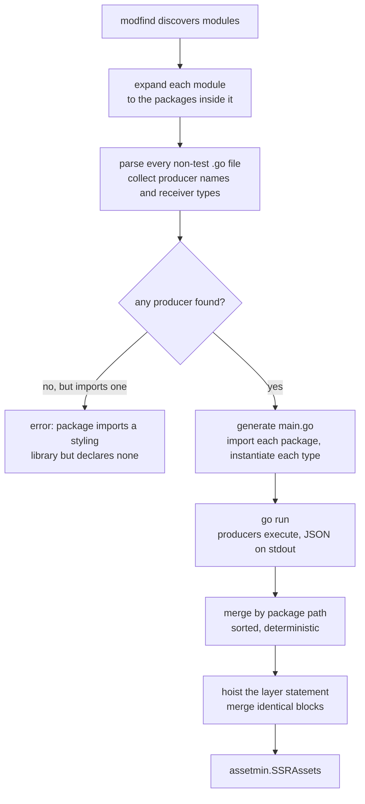
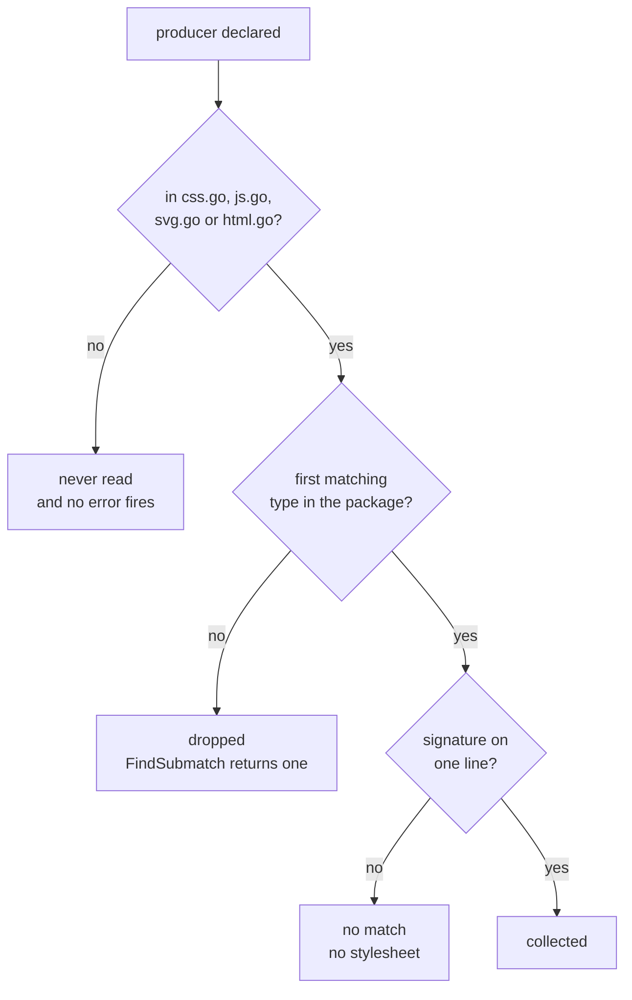

# Extraction pipeline

How a producer method becomes a line in the shipped stylesheet. Context in
[ARCHITECTURE.md §4](../ARCHITECTURE.md#4-extraction-model).

Detection identifies **names and types only**. Correctness of the call is
delegated to the Go compiler when the generated program is built, which is why a
producer may return any type with the right shape.

## Where assets are lost today

All three loss paths end in a green build and an unstyled component. Closing them
is the subject of [SPECS.md §6](../SPECS.md#6-published-behaviour).
